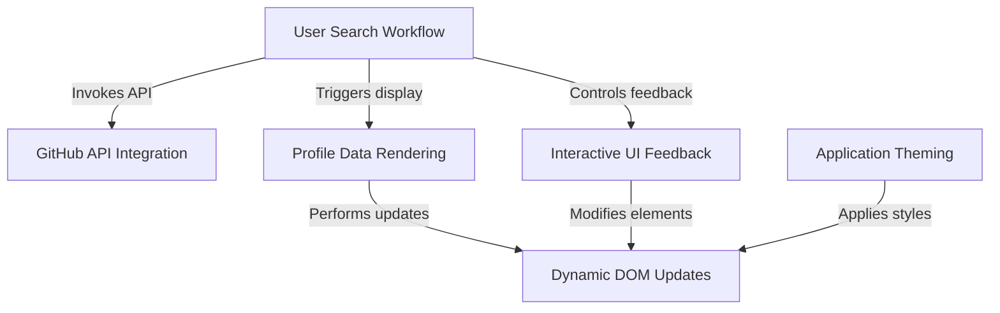

# Tutorial: GithubProfileChecker

This project, 'GitHub Profile Checker,' is a handy web application designed to help you *quickly find and view* GitHub user profiles. You simply **enter a username**, and the app fetches and displays important details like their picture, bio, and follower count. It also provides *helpful messages* if a user isn't found and lets you switch between **light and dark themes** for a comfortable viewing experience.

## 🚀 Features

- Search for GitHub users
- Display profile info (avatar, bio, followers, etc.)
- Responsive design
- Fast and lightweight

## Visual Overview

