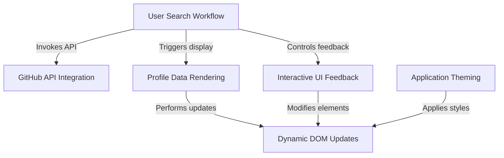

# GitHub Profile Explorer

A simple web app to search for GitHub users and view their profile details.

## Features

- Search for any GitHub username
- View profile info: avatar, name, bio, location, company, website, join date
- See public repo, follower, and following counts
- Responsive design using Tailwind CSS
- Dark mode toggle

## Visual Overview

## Usage

1. Clone or download this repository.
2. Open [`GithubProfileChecker/index.html`](GithubProfileChecker/index.html) in your browser.
3. Enter a GitHub username and click "Search".

## Project Structure

- [`index.html`](GithubProfileChecker/index.html): Main HTML file
- [`style.css`](GithubProfileChecker/style.css): Custom styles
- [`script.js`](GithubProfileChecker/script.js): App logic

## Dependencies

- [Tailwind CSS CDN](https://cdn.tailwindcss.com) 
